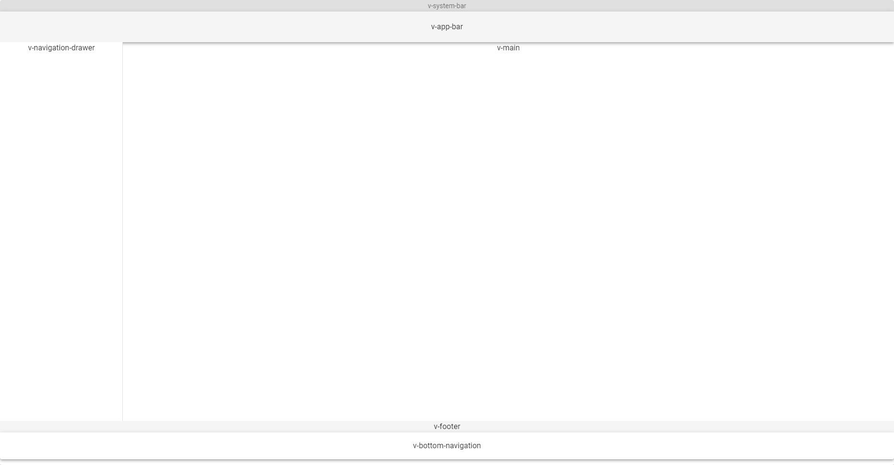
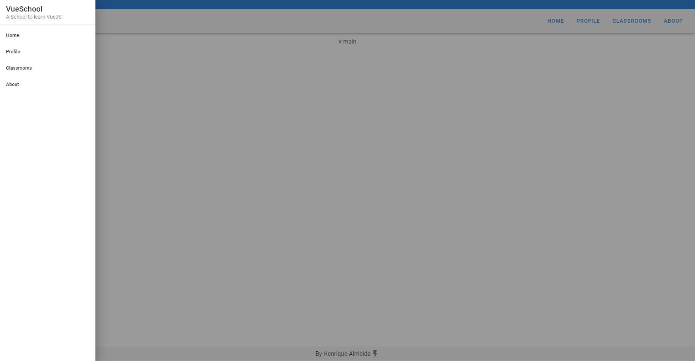
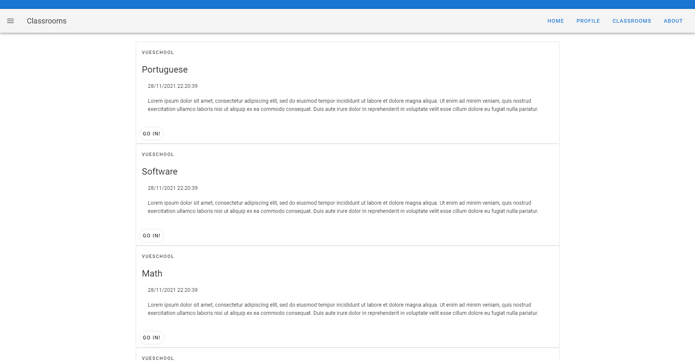
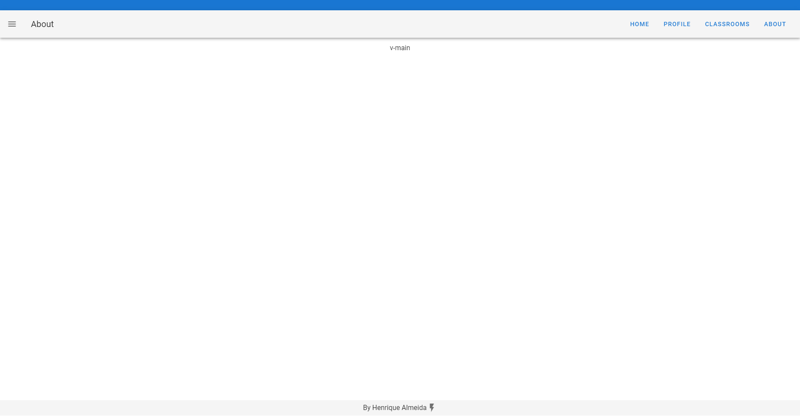
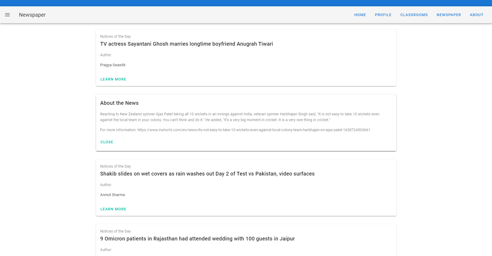

## Avaliação Final - WEB

# Resultado Final (AF1)



# Resultado Final (AF2)

## Drawer



## Home


## Classrooms



## Profile


## About



# Resultado Final (AF3)



## Project setup

```
yarn install
```

### Compiles and hot-reloads for development

```
yarn serve
```

### Compiles and minifies for production

```
yarn build
```

### Lints and fixes files

```
yarn lint
```

### Customize configuration

See [Configuration Reference](https://cli.vuejs.org/config/).
